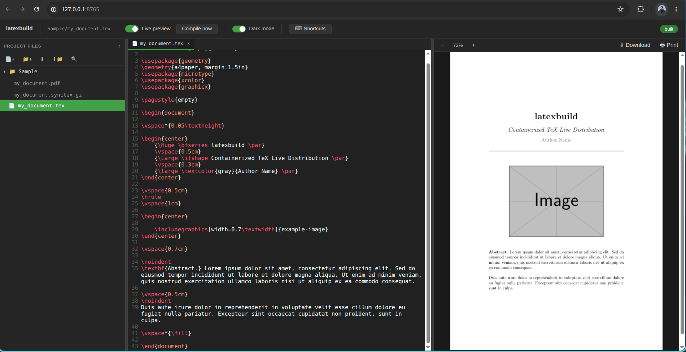

# Texiom

[](https://github.com/MrzAhmadi/Texiom/releases)

Compile any `.tex` file into a PDF using a containerized, full TeX Live
distribution — no LaTeX installation required on the host machine.

## Why

Installing a full TeX Live distribution locally is slow, large, and easy to
get out of sync across machines. This project packages `texlive-full`,
`latexmk`, and `biber` into a single Docker image (also usable as a VS Code
Dev Container) and provides a small `texiom` command that compiles any
`.tex` file on your host by mounting its directory into the container.

## Requirements

- [Docker](https://docs.docker.com/get-docker/)
- Bash

No LaTeX distribution needs to be installed on the host.

**On Windows:** there's no native Windows build - use
[WSL2](https://learn.microsoft.com/windows/wsl/install) instead. Docker
Desktop already requires WSL2 for Linux containers, so this isn't an
extra dependency: install Docker Desktop, enable WSL2 integration for
your distro (Settings → Resources → WSL Integration), then open that
distro's terminal (e.g. Ubuntu) and follow the Linux instructions below
exactly as written - `texiom` runs unmodified there.

## Installation

Download the latest release from the
[Releases page](https://github.com/MrzAhmadi/Texiom/releases).

**Debian / Ubuntu:**

```bash
sudo dpkg -i texiom_*.deb
```

**Fedora / RHEL:**

```bash
sudo rpm -i texiom-*.rpm
```

**Any other Linux (generic tarball):**

```bash
tar -xzf texiom-*-linux.tar.gz
cd texiom-*/
sudo ./install.sh
```

Each of these installs a `texiom` command onto your `PATH`, usable from
any directory.

**Running from a git checkout without installing:**

```bash
git clone https://github.com/MrzAhmadi/Texiom.git
cd Texiom
./texiom
```

## Usage

```bash
texiom
```

It will interactively ask for the path to your `.tex` file (tab-completion
works, so you can navigate straight to it):

```
Path to the .tex file (or its directory): /path/to/your/project/paper.tex
```

Or run it non-interactively:

```bash
texiom --dir /path/to/your/project --file paper.tex
```

The resulting `paper.pdf` (and all `latexmk` auxiliary files) will appear
next to `paper.tex` in the original directory. Pass `--pdf-only` if you
just want the `.pdf` and none of the auxiliary files.

To rebuild automatically every time you save the file, pass `--watch`:

```bash
texiom --dir /path/to/your/project --file paper.tex --watch
```

This keeps running in the foreground and recompiles on every change to
`paper.tex` (or anything it includes) until you press Ctrl+C.

Only run one `--watch` per file at a time - two instances writing to the
same `.aux`/`.log` files at once will race each other and can produce
spurious `latexmk` errors.

### Live browser editor

For a rebuild-as-you-type experience, pass `--edit`:

```bash
texiom --edit
```



No `--dir`/`--file` needed - the editor's project lives entirely inside a
persistent Docker volume (`texiom-workspace`), not on your host
filesystem. Use the sidebar to create folders/files, upload existing files
(images, `.bib`, etc.), rename, and delete - everything is managed from
the browser. The volume persists across sessions, so your project is
exactly as you left it the next time you run `texiom --edit`, even after
the container exits.

The browser splits in two: your `.tex`/`.bib` source on the left, the
compiled PDF on the right, with a file-tree sidebar for the project. Every
edit recompiles automatically (debounced briefly after you stop typing)
and refreshes the PDF; auxiliary build files (`.aux`, `.log`, `.fls`,
`.fdb_latexmk`, etc.) are always cleaned up after a successful build,
leaving just the `.pdf` (plus the small `.synctex.gz` needed for PDF↔source
jump navigation) next to your `.tex` source. The toolbar also lets you
compile manually or switch to dark mode; the sidebar lets you switch
between open files via tabs - see the in-app "⌨ Shortcuts" menu (or press
F1) for the full list of keyboard shortcuts, including Ctrl+S to save.
Ctrl+C in the terminal stops the session; the tab picks back up on its
own once you run `--edit` again. Run `texiom --kill-edit` if you need
to stop a session without a terminal open (e.g. it's stuck or was
disowned).

It's a small local web server (source and PDF only ever touch
`127.0.0.1`), not a general-purpose editor - no autocomplete, snippets, or
extensions beyond what's listed above.

To wipe the persistent project and start over: `docker volume rm
texiom-workspace` (only while no `--edit` session is running).

#### Rebuilding as you type, before you save (using your own editor instead)

If you'd rather keep using VS Code (or another editor) instead of the
browser-based `--edit`, `--watch` only sees changes once they're written
to disk, and an editor's unsaved buffer lives in memory only - so with a
manual save, the rebuild is one keystroke-to-save behind you. To have it
kick in automatically, enable Auto Save in VS Code so it writes the file
for you shortly after you stop typing:

1. Open VS Code's Settings (`Ctrl+,`).
2. Search for `files.autoSave` and set it to `afterDelay`.
3. Search for `files.autoSaveDelay` and set it to a short delay, e.g. `1000`
   (milliseconds).

Or add both directly to `settings.json`:

```json
"files.autoSave": "afterDelay",
"files.autoSaveDelay": 1000
```

With this on, VS Code saves the file on its own a second after you stop
typing, and a running `--watch` picks up that save and rebuilds - no manual
Ctrl+S needed.

### Options

| Flag              | Description                                                |
|-------------------|-------------------------------------------------------------|
| `-d, --dir DIR`   | Directory containing the `.tex` file (not used with `--edit`) |
| `-f, --file FILE` | Name of the `.tex` file (`.tex` extension optional); not used with `--edit` |
| `-t, --tag TAG`   | Docker image tag to use/build (default: `texiom`)         |
| `-r, --rebuild`   | Force a fresh image build even if one already exists        |
| `-p, --pdf-only`  | Remove `latexmk`'s auxiliary files after a successful build, leaving only the `.pdf` |
| `-w, --watch`     | Rebuild automatically whenever the `.tex` file changes, until Ctrl+C |
| `-e, --edit`      | Open the browser editor for your persistent in-container project, until Ctrl+C |
| `-k, --kill-edit` | Stop any running `--edit` session (frees its port) and exit |
| `-v, --version`   | Show the installed version                                  |
| `-h, --help`      | Show usage                                                   |

The first run builds the Docker image (a few minutes, since `texlive-full`
is a large distribution); every run after that reuses the cached image, so
compilation is fast. Upgrading `texiom` to a new version automatically
rebuilds the image once if that version needs a different one - no manual
`--rebuild` required.

## Using as a VS Code Dev Container

Open this folder (or any project that references this `.devcontainer/`) in
VS Code with the [Dev Containers extension](https://marketplace.visualstudio.com/items?itemName=ms-vscode-remote.remote-containers)
and choose "Reopen in Container" for an interactive environment with the
LaTeX Workshop extension pre-configured to build on save.

## Using Texiom as a GitHub Action

The same image is published to GHCR and available as a reusable GitHub
Action, so any repo with a `.tex` file can build a PDF on every push
without installing anything:

```yaml
- uses: actions/checkout@v4
- uses: MrzAhmadi/Texiom@main
  with:
    root_file: paper.tex
```

Pin to a released tag (e.g. `@v0.0.3`) instead of `@main` for reproducible
builds once one exists.

### Inputs

| Input               | Description                                                    | Default                                        |
|---------------------|------------------------------------------------------------------|-------------------------------------------------|
| `root_file`         | Path to the main `.tex` file, relative to `working_directory`    | *(required)*                                     |
| `working_directory` | Directory containing the `.tex` sources                          | `.`                                              |
| `args`              | Arguments passed to `latexmk`                                    | `-pdf -interaction=nonstopmode -halt-on-error`   |

The compiled PDF is left next to the source file for a later step (e.g.
`actions/upload-artifact`, or attaching it to a release) to pick up.

### Attaching the PDF to a GitHub Release on tag

```yaml
name: Release PDF

on:
  push:
    tags: ['v*']

jobs:
  build:
    runs-on: ubuntu-latest
    steps:
      - uses: actions/checkout@v4

      - uses: MrzAhmadi/Texiom@main
        with:
          root_file: paper.tex

      - uses: softprops/action-gh-release@v2
        with:
          files: paper.pdf
```

## License

MIT
